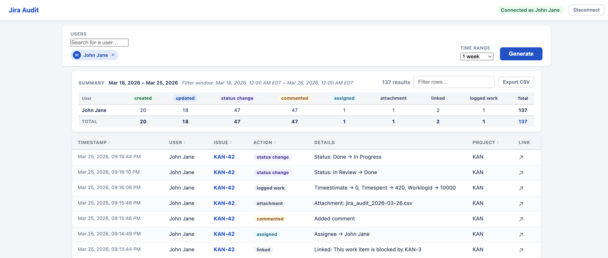

# Jira User Actions Audit Report

A local web app that produces a complete, field-level audit of Jira user activity using the Jira Cloud REST API. Select one or more users, choose a date range, and get a sortable, filterable, exportable table of every action they took — with exact timestamps, field-level change details, and a per-user summary matrix.



---

## Download and Run (no git required)

### Step 1 — Download the files

1. Go to **[https://github.com/barkev-dino/jira-user-actions-audit-report](https://github.com/barkev-dino/jira-user-actions-audit-report)**
2. Click the green **Code** button
3. Click **Download ZIP**
4. Unzip the downloaded file — you'll get a folder called `jira-user-actions-audit-report-main`

### Step 2 — Install Python (if you don't have it)

Check if Python is already installed by opening a terminal (Mac: `Terminal`; Windows: `Command Prompt` or `PowerShell`) and running:

```
python3 --version
```

If you see a version number (3.9 or higher), skip to Step 3.

If not, download and install Python from **[https://www.python.org/downloads](https://www.python.org/downloads)** — check **"Add Python to PATH"** during installation on Windows.

### Step 3 — Run the app

**Windows — double-click launcher:**

Simply double-click **`launch.bat`** inside the unzipped folder. It will:
- Install all dependencies automatically (first run only)
- Start the server
- Open your browser to the app

> If Windows shows a security warning ("Windows protected your PC"), click **More info → Run anyway**. This appears because the file isn't code-signed.

**Mac / Linux — terminal:**
```bash
cd jira-user-actions-audit-report-main
python3 -m venv .venv
source .venv/bin/activate
pip install -r requirements.txt
uvicorn app:app --port 8000
```

### Step 4 — Open in your browser

The browser should open automatically on Windows. If not, go to: **[http://localhost:8000](http://localhost:8000)**

You'll see the setup screen. Enter your Jira site URL, email, and API token to get started (see [First Use — Auth Setup](#first-use--auth-setup) below).

> **To stop the app**, close the terminal window or press `Ctrl+C`.
> **Next time on Windows**, just double-click `launch.bat` again — setup is skipped after the first run.

---

## Why REST, not the Activity Stream

The Jira Activity Stream was evaluated and rejected as the report source:

- **Incomplete by design.** It is a curated feed with server-side entry caps — it cannot be relied upon to return *all* activity for a window.
- **Pagination is unreliable.** The `endDate` cursor that controls backward pagination can be silently ignored by Jira, causing infinite loops or truncated results.
- **No field-level change data.** The stream reports only "user updated KAN-42". The REST changelog gives `Status: To Do → In Review`, `Due Date → 2026-03-25`, etc.
- **User filter is undocumented for API token auth.** The `account-id+IS+{id}` filter is not officially supported under API token authentication in Jira Cloud.

The app uses four REST calls instead:

1. **JQL scan** (`/rest/api/3/search/jql`) — find all issues updated in the window (with ±1 day padding to survive Jira's site-timezone JQL interpretation).
2. **Per-issue changelog** (`/rest/api/3/issue/{key}/changelog`) — complete, authoritative field history per issue.
3. **Per-issue comments** (`/rest/api/3/issue/{key}/comment`) — full comment text via ADF parsing.
4. **Creation JQL** (`reporter = X AND created >= Y`) — capture issue creation events (not present in changelog).

Python-side `_row_in_window` is the authoritative filter; JQL is only the coarse scan.

---

## Quick Start

### 1. Install dependencies

```bash
cd jira_user_audit_report
python3 -m venv .venv
source .venv/bin/activate
pip install -r requirements.txt
```

### 2. Run the server

```bash
uvicorn app:app --reload --port 8000
```

### 3. Open in browser

```
http://localhost:8000
```

---

## First Use — Auth Setup

On first launch you'll see the **Setup** screen.

| Field | Value |
|---|---|
| Jira Site URL | `https://yoursite.atlassian.net` |
| Atlassian Email | Your Atlassian account email |
| API Token | Generate at [id.atlassian.com/manage-profile/security/api-tokens](https://id.atlassian.com/manage-profile/security/api-tokens) |

Click **Save and Verify**. The app calls `/rest/api/3/myself` to confirm access and saves credentials to `~/.jira_audit_config.json` (mode 0600).

On every subsequent page load, `/api/status` re-verifies the saved credentials live — if the token has been revoked, the setup screen is shown immediately. If credentials expire *during* a report run, an inline auth-failure banner is shown with a "Go to Setup" button.

---

## Generating a Report

1. Type at least **2 characters** in the **Users** box — results come from `/rest/api/3/user/search`.
2. Click a result to add it as a chip. Add as many users as you like.
3. Choose a **Time Range**:
   - **Presets** (1 day, 2 days, 3 days, 1 week, 30 days) — snaps to local calendar midnight boundaries. "1 day" = today's full local day; "7 days" = the last 7 full local days including today.
   - **Custom…** — reveals a date picker. Select any start and end date; the filter covers the full local days selected (midnight-to-midnight in your browser's timezone).
4. Click **Generate Report**.

The app runs a background job that:
- Scans all issues updated in the window via JQL (paginated, ±1 day buffer)
- Fetches the full changelog and all comments for each issue
- Separately captures any issues the user created in the window
- Streams progress updates (`Issue N/M · KEY · fetching changelog…`)

Once complete, the **filter window** is displayed under the Summary heading — exact local-time boundaries used for the query, so you always know what was and wasn't included.

---

## Timezone Handling

All date windows use **local calendar-day semantics** from the browser:

- The frontend sends `tz_offset_minutes` (from `new Date().getTimezoneOffset()`) with every report request.
- The backend converts local YYYY-MM-DD dates to UTC using: `UTC_midnight = local_midnight + timedelta(minutes=tz_offset_minutes)`.
- `from_date` = local midnight of the start date; `to_date` = local midnight of the day *after* the end date (exclusive upper bound).
- An event at 11 PM local on the last selected day is correctly included.

---

## Results Table

| Column | Description |
|---|---|
| Timestamp | When the activity occurred (your local time) |
| User | Display name of the actor |
| Issue Key | Clickable Jira issue key |
| Action | Color-coded pill: Created / Updated / Status Change / Commented / Assigned / Attachment / Linked / Logged Work |
| Details | Field-level description: `Status: To Do → In Review`, `Comment: text…`, `Assignee → Alice`, etc. |
| Project | Project key extracted from the issue key |
| Link | Direct ↗ link to the issue in Jira |

- **Sort** any column by clicking its header (natural sort for issue keys: KAN-2 before KAN-11).
- **Filter** all columns with the free-text filter box.
- **Export CSV** downloads the current filtered view.
- **Summary table** above the results shows a user × action-type breakdown with totals.
- **Filter window** label shows the exact local-time boundaries used for the query.

---

## Action Classification

| Pill | Trigger |
|---|---|
| `created` | Issue was created by this user in the window |
| `status_change` | Any status transition (To Do → In Progress, → Done, → Closed, etc.) |
| `assigned` | Assignee field changed |
| `attachment` | Attachment added or removed |
| `linked` | Issue link added or removed |
| `logged_work` | Time logged (`timespent`, `worklogid`, `timeestimate`, etc.) |
| `commented` | Comment added |
| `updated` | Any other field change |

Status transitions to Resolved, Closed, or Reopened are all classified as `status_change` — not separate categories.

---

## File Structure

```
jira_user_audit_report/
├── app.py              FastAPI routes, background job runner, REST report logic
├── jira_client.py      Jira REST: auth verify, user search, JQL, changelog, comments
├── parser.py           Dedupe and sort helpers for ReportRow lists
├── models.py           Pydantic request/response models
├── job_store.py        In-memory job tracking (pending → running → done | error)
├── config_store.py     Credential persistence (~/.jira_audit_config.json, mode 0600)
├── requirements.txt
├── tests/
│   └── test_dates.py   Unit tests for timezone date-window logic
├── templates/
│   └── index.html      Single-page frontend
└── static/
    ├── app.js          Frontend logic (vanilla JS, no bundler)
    ├── styles.css      Layout and component styles
    └── spinner.css     Loading spinner animation
```

---

## Running Tests

```bash
source .venv/bin/activate
pip install pytest
pytest tests/ -v
```

Tests cover `_local_midnight_utc` (UTC conversion for EDT, PST, IST, UTC) and `_row_in_window` (inclusive start, exclusive end, late-evening events, invalid timestamps).

---

## Credentials Storage

Credentials are stored in `~/.jira_audit_config.json` with permissions `0600`.
They are never stored in the project directory and are not committed to git.

To clear saved credentials, click **Disconnect** in the top bar or call:

```bash
curl -X POST http://localhost:8000/api/auth/clear
```

---

## API Reference

| Method | Path | Description |
|---|---|---|
| GET | `/` | Serves `index.html` |
| GET | `/api/status` | Verifies saved credentials live; returns auth state |
| POST | `/api/auth/test` | Verifies and saves credentials |
| POST | `/api/auth/clear` | Removes saved credentials |
| GET | `/api/users/search?q=` | Searches Jira users (min 2 chars) |
| POST | `/api/report/start` | Starts a background report job |
| GET | `/api/report/{job_id}` | Polls job status / returns results + filter window |

### Report request body

```json
{
  "account_ids":        ["<jira-account-id>"],
  "display_names":      {"<account-id>": "Alice Smith"},
  "range_key":          "7d",
  "tz_offset_minutes":  240,
  "start_date":         null,
  "end_date":           null
}
```

For `range_key = "custom"`, provide `start_date` and `end_date` as `"YYYY-MM-DD"` strings. `tz_offset_minutes` is `new Date().getTimezoneOffset()` from the browser.
